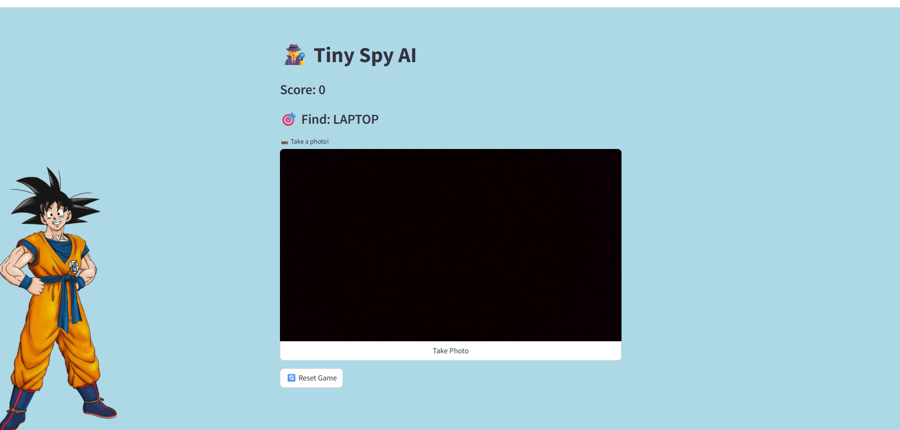

# README-Computer Vision Module- "Tiny Spy AI!" my-aipi-app-296920955988.us-central1.run.app

## Brian Benedicks

<!-- Add your content below -->

### Ethics Statement

This application prioritizes child safety and educational development. No data is collected, stored, or transmitted for any purpose to maintain complete child privacy - all camera processing occurs locally on the user's device. We require children to play with an adult present to help navigate the interface and ensure appropriate use of the AI.

### Objective- After reflecting on how to bring computer vision to the educational sphere, I had the idea dawn on me while my twin sister was teaching her children, both toddlers, new vocabulary. How great would it be to have an app that can instruct the kids to find common household objects and provide realtime feedback. It provides a means to take advantage of the adaptation of technology children are undergoing earlier and earlier with the need to develop their childhood lexicon.

### 1. Data Sources

- A script was used to download images of common household objects. These were placed in a directory where each folder was a class with respective images contained in each folder. This was for the NB, SVC and RESNET 50 Comparison.
- For the app itself, I used the COCO dataset from ROBOFLOW and created a smaller dataset for finetuning a YOLO model.

### 2. Data/Feature Engineering 

1. For SVC and Gaussian NB, I wanted to extract color histograms from each image via extracting each channel separately, then concantenating at the end for the features. Each channel was flattened prior to processing.
2. For RESNET50, I employed a ImageDataSet Class that was able to transform my data to fit to the appropriate size to feed the CNN. RESNET50 required no further data processing.
3. The YOLO COCO subset required no further processing. I just needed to ensure the YAML file was present for YOLO V8 to detect.

### 3. Modeling Approach
1. Gaussian NB via color histograms was used to determine distribution of certain color channels and how accurately a class could be predicted. 
2. SVC we did not optimize and instead just used the radial based function hyperparamter.
3. RESNET50- Trained on 100 epochs utilizing the adaptive moment estimation (ADAM) optimization.
4. YOLOV8- Employed this model for ultralytics for object detection. Using a Finetune approach, I first froze the first 10 layers. I then proceeded to train the full model with a much smaller lr to improve accuracy.

### 4. Model Evaluation
1. The accuracy improved in the order laid out above. NB, since it assumes feature independence, was increadibly inaccurate-it ignores the complexities of the world. SVC was a marked improvement, but image classifiction proves to have too many non linear relationhios; the amount of time to compute and optimal hyperparameters for a usable SVC is not worth it's time.
2. Confusion Matrix, Accuracy, Precision, mAP/IoU for YOLO
2. Accuracies:
   Model Comparison:
   1. Gaussian Naive Bayes: 0.0659 
   2. Support Vector Classifier: 0.0759 
   3. ResNet50 (PyTorch): 0.4785
   
3. From the above, it is readily apparent that a deep neural network provides the most apt mean for image classification.

### Dependencies- The project employed the following depencies:
streamlit>=1.28.0
ultralytics>=8.0.0
opencv-python-headless>=4.8.0
pillow>=9.5.0
numpy>=1.24.0
pyyaml>=6.0
torch>=2.0.0
torchvision>=0.15.0

### Application:

### To run:
1. Place all files in the same directory and run the script
   

### Lessons Learned:
1. THe importance of directory structuring. It took sometime to structure the images in my project directory-I'm usually messy when it comes to organization.
2. The power of datasets. After attempting to draw bounding boxes on as many images as possible, I recognized I would be unable to label enough images to have any reasonable amount of bounding boxes for object detection. I therefore finetuned YOLO a subset of household items in the COCO dataset.
3. THe power of the GPU. My first go on google COLAB took way longer than I expected. Turns out I was not on a GPU runtime! It definitely elucidates the power of parallel processing and how CUDA made NVIDIA so lucrative.

